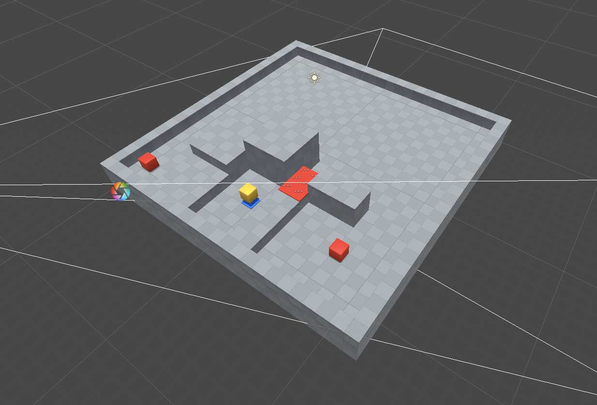
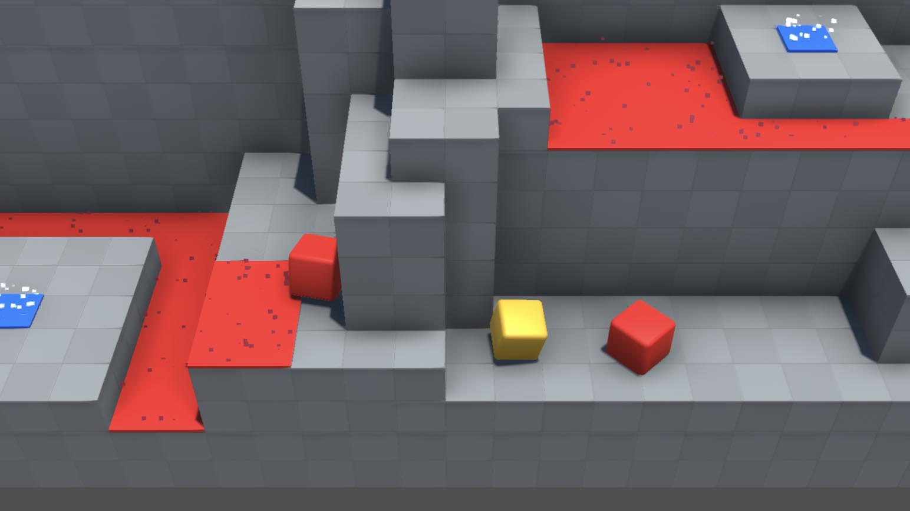
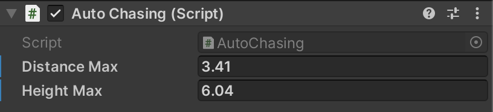
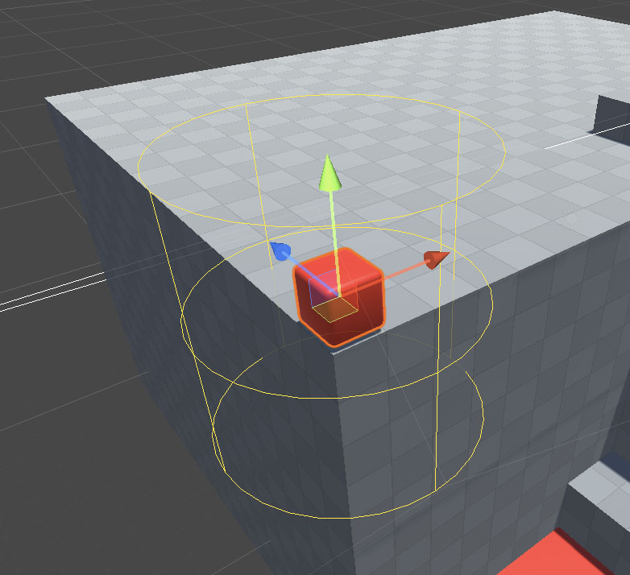

# Mini-Puzzle-Level

Ok, le temps est venu de se livrer à un petit exercice de level design.

## Description

Réaliser un petit niveau sur la base d'un plateau de 24 x 24 cases.

Le niveau, composé de blocks qui dessinent un parcours, doit contenir, outre le
`PlayerCube`, les briques de gameplay suivantes : 
- SpawnPoint (pour ne pas avoir à recommencer le parcours depuis le début)
- Destroyer / KillZone (n'importe quel collider accompagné du script [Destroyer.cs](../Assets/Common/Scripts/Destroyer.cs)), 
  histoire de proposer une difficulté.
- StupidBots, des ennemis stupides qui avancent dans la direction du joueur.

L'évaluation se fera selon les 2 critères suivants :
- Maîtrise technique (pas de bug, relative complexité du level design)
- Level design (le parcours présente-t-il un intérêt ?)

## Notes: 
- Il se trouve un mini niveau de démonstration dans People/jniac/Scenes/MiniPuzzleLevel.
  Celui peut servir de base à votre version.
- Parmi les ajustements nécessaires, il faut particulièrement faire attention à 
  la "hauteur" de saut" du script cubemove ("Jump Speed"), une valeur de `9` permet
  de sauter 2 cubes, mais pas 3 (d'autres valeurs sont possibles, pour par exemple
  pouvoir sauter 1 cube mais pas 2).
- Un autre ajustement important est la "zone" de détection des `StupidBots` 
  (AutoChasing.cs). Deux propriétés permettent de déterminer quand le stupidbots
  part à la chasse. Un bon LevelDesign nécessitera probablement d'ajuster les 
  valeurs "localement" selon la configuration spatial où se trouve le bot.
   
  
   
  

## Rendus:
- Une scène Unity nommé "MiniPuzzleLevel" présent dans le dossier "Scenes" de votre
  dossier personnel (et "poussé" sur Github).

